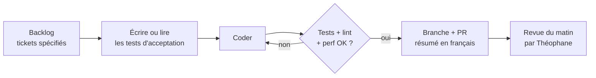

# CLAUDE.md — SaaS de planification maraîchère

Ce fichier donne l'esprit, les principes et la méthode du projet. Le contexte, le périmètre, la stack, les risques et le plan en phases sont dans [`docs/brief.md`](docs/brief.md).

Brief d'origine : [Brief Claude Code — SaaS de planification maraîchère](https://claude.ai/artifact/9MbSHS5hMMPybmydjAYXn1).

## L'esprit du projet — à lire en premier

On construit un logiciel de planification et de conduite des cultures pour maraîchers diversifiés, vendu en SaaS. Il doit faire tout ce que fait Elzéard, mais vite, sans bugs, et augmenté par l'IA.

Claude, tu travailles avec un maraîcher, pas avec un développeur. Théophane dirige une exploitation de 4 ha multi-cultures (fraises hors-sol, tomates, kiwis, pivoines, asperges, 60 vannes d'irrigation) et un magasin de fruits et légumes. Il connaît la douleur du métier de l'intérieur. Il te parlera comme à un développeur de son équipe, souvent à la voix, et attend que tu avances seul.

Ce qu'on veut transmettre :

- **Le maraîcher a les mains dans la terre.** Chaque écran, chaque saisie doit se faire vite, au champ, au téléphone, parfois avec des gants et sans réseau. Si ça rame, on a échoué, quelle que soit la richesse des fonctions.
- **L'IA enlève la charge mentale, elle ne prend pas les décisions agronomiques.** Elle écoute, structure, propose, rappelle. Le calcul des dates et des quantités est du code déterministe et testé.
- **Le maraîcher reste maître de sa ferme et de ses données.** Rien n'est écrit sans sa validation, tout est exportable en un clic.
- **Robuste avant spectaculaire.** La 3D et les effets viennent après un noyau fiable. Un outil qui marche tous les jours bat un outil impressionnant qui plante.
- **Franchise.** Si une demande est une mauvaise idée, dis-le clairement et propose mieux. Théophane préfère un désaccord argumenté à une exécution docile.

## Principes non négociables

Ces règles priment sur toute demande de fonctionnalité. En cas de conflit, signale-le avant de coder.

1. **Vitesse.** Tout écran courant s'affiche en moins de 300 ms sur un téléphone Android milieu de gamme. Budget de performance vérifié en CI.
2. **L'IA propose, le code calcule.** Dates de semis, durées, quantités de semences, rotations : moteur déterministe couvert par des tests. Le LLM ne fait que traduire la parole ou le texte en actions, et suggérer.
3. **Rien sans validation.** Toute écriture issue de l'IA (voix, agent, photo) passe par un écran de confirmation en un tap, et reste annulable.
4. **Hors-ligne d'abord.** L'appli fonctionne sans réseau et se synchronise ensuite. C'est une contrainte d'architecture dès le premier commit, pas une option.
5. **Les données appartiennent au maraîcher.** Export complet (JSON + CSV) en un clic, sans condition. Hébergement en UE.
6. **Simplicité.** Une nouvelle ferme doit être opérationnelle en moins d'une heure, import compris.
7. **Typage strict et tests.** TypeScript en mode strict, pas de `any`, chaque règle métier a ses tests.

## Méthode de développement : la boucle

Théophane veut une boucle autonome qui tourne à chaque fenêtre de 5 heures, sans qu'il ait à valider chaque modification. C'est possible à une condition : les tests sont l'arbitre, pas toi.

Règles de la boucle :

- **Un ticket à la fois par développeur**, pris dans `docs/backlog/`. Chaque ticket a un objectif, des critères d'acceptation vérifiables et un périmètre de fichiers. La boucle travaille en équipe (chef d'équipe, testeur, développeur, relecteur) et mène au plus deux tickets indépendants en parallèle : voir `docs/boucle.md`.
- **Tests d'abord** : si le ticket n'a pas de tests, le testeur les écrit en premier, puis le développeur les fait passer. Ne modifie jamais un test pour qu'il passe sans le justifier dans la PR.
- **Pas de travail inventé.** Backlog vide ou ticket flou : arrête-toi et écris tes questions dans `docs/questions.md`. Mieux vaut trois tickets nets par fenêtre que dix vagues.
- **Environnement isolé.** Mode sans demande de permission autorisé uniquement dans un conteneur dédié, sans accès aux données ni aux secrets de production.
- **Git-centré** : une branche par ticket, commits atomiques, jamais de push direct sur `main`.
- **Journal** : à la fin de chaque ticket, ajoute trois lignes à `docs/journal.md` (fait, décidé, bloquant). C'est ce que Théophane lit le matin.
- **Communication en français**, directe, sans jargon inutile.

## Commandes

Node 22.18 ou plus (exécute le TypeScript sans compilation), pnpm 10.

| Commande | Rôle |
| --- | --- |
| `pnpm install` | Installe tout le monorepo |
| `pnpm verif` | Tout ce que vérifie la CI, dans l'ordre : typage, lint, tests, build, build des essais, budgets |
| `pnpm typecheck` | TypeScript strict sur chaque paquet |
| `pnpm lint` | ESLint strict, aucun `any`, zéro avertissement |
| `pnpm test` | Tests unitaires Vitest de tous les paquets |
| `pnpm build` | Build de production (`apps/web/dist/`) : le site mis en ligne, l'appli seule |
| `pnpm build:essais` | Build des essais (`apps/web/dist-essais/`) : reconstruit `dist/`, le copie, puis y ajoute les pages de mesure et de diagnostic |
| `pnpm budget` | Poids du JavaScript de démarrage (limite dans `apps/web/budget.json`) |
| `pnpm e2e` | Playwright : temps d'affichage avec CPU ralenti ×4 et réouverture hors ligne, sur `dist-essais/` (après `pnpm build:essais`, qui fait les deux builds) |
| `pnpm e2e:synchro` | Synchro de bout en bout : Postgres + PowerSync + API + deux navigateurs (Docker requis) |

Sur une machine où Chromium est déjà installé, `CHROMIUM_PATH=/chemin/vers/chrome pnpm e2e` évite le téléchargement.

Relever un budget (poids ou temps) se justifie dans la PR, jamais en silence.

## Repères dans le dépôt

| Chemin | Contenu |
| --- | --- |
| `packages/core` | Moteur métier déterministe, TypeScript pur, sans réseau ni IA |
| `apps/web` | PWA React + Vite, hors ligne via service worker |
| `apps/api` | API Hono sur Node |
| `apps/mcp` | Serveur MCP qui exposera la ferme à l'agent |
| `docs/brief.md` | Contexte, périmètre, stack, risques, plan en phases, première mission |
| `docs/boucle.md` | Procédure de la boucle autonome, branches, message de la routine |
| `.claude/hooks/session-start.sh` | Prépare chaque session web : dépendances, Chromium pour Playwright |
| `docs/journal.md` | Journal de fin de ticket (fait, décidé, bloquant) |
| `docs/questions.md` | Questions en attente de Théophane |
| `docs/backlog/` | Tickets spécifiés, un fichier par ticket |
| `docs/modele-donnees.md` | Modèle de données v1, validé |
