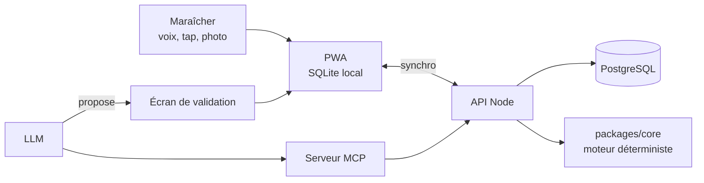

# Brief — SaaS de planification maraîchère (alternative à Elzéard)

L'esprit du projet, les principes non négociables et la méthode de la boucle sont dans [`CLAUDE.md`](../CLAUDE.md). Ce fichier contient le reste du brief.

Brief d'origine : [Brief Claude Code — SaaS de planification maraîchère](https://claude.ai/artifact/9MbSHS5hMMPybmydjAYXn1), version du 25 septembre 2026.

## Contexte et marché

Théophane a quitté Elzéard parce que l'application rame, accumule les bugs et n'intègre aucune IA. Le périmètre fonctionnel d'Elzéard reste la référence de ce qu'un maraîcher attend : planification, assolement, plan de culture, équipes, récoltes, stocks, livraisons, traçabilité, bilans de saison.

| Outil | Positionnement | Ce qu'on en retient |
| --- | --- | --- |
| [Elzéard](https://www.elzeard.co/faq/) | SaaS français complet, multi-ateliers | La référence fonctionnelle, mais lente et sans IA |
| [Brinjel](https://brinjel.com/en/) | Open source, fait par des maraîchers, hébergé en UE | Gratuit à l'essai : planifier des séries ne suffit pas à se différencier |
| Qrop | Logiciel libre (Atelier Paysan) | Même constat, forte communauté |
| [Tend](https://www.fertilizerdaily.com/20260313-tend-promotes-ai-powered-farm-management-platform-for-modern-growers/) | SaaS américain | Déjà un mode hors-ligne et une bibliothèque de cultures assistée par IA |

Notre différence doit donc venir de trois choses : la vitesse, la saisie vocale au champ, et un agent qui pilote la ferme par la conversation (via MCP).

Deux objections reviennent contre les SaaS agricoles ([source](https://etsioui.fr/les-outils-de-planification-pour-le-maraichage-diversifie/)) : le coût de l'abonnement pour les petits revenus, et la propriété des données de la ferme. On y répond dès la conception.

## Périmètre fonctionnel

### Indispensables (sans ça, personne ne paie)

- **Parcellaire** : îlots, planches (longueur, largeur), abri ou plein champ. Chaque planche est une ligne de temps.
- **Bibliothèque de cultures et itinéraires techniques** paramétrables (densité, écartement, durée pépinière, durée en place, fenêtre de récolte, rendement attendu). Point de départ possible : la base de référence de l'INRAE (Pépinière-Mesclun).
- **Plan de culture et séries**, avec alertes de rotation (délai de retour par famille botanique) et de conflit d'occupation de planche.
- **Semainier automatique** : semis, plantations, récoltes générés depuis le plan. Calcul des besoins en semences et en plants.
- **Saisie terrain mobile hors-ligne** : réalisé, interventions, observations.
- **Récoltes reliées aux stocks.**
- **Registre phytosanitaire et traçabilité**, export prêt pour un contrôle bio.
- **Import** depuis Elzéard, Qrop, Brinjel et Excel/CSV. La saisie initiale est le premier frein au changement d'outil.

### Différenciants (pourquoi on quitte Elzéard)

- **Journal vocal de terrain** : « planche 12, irrigation 20 minutes, pucerons sur les fèves » devient des enregistrements structurés, validés en un tap.
- **Agent conversationnel via un serveur MCP** exposant la ferme : « qu'est-ce que je sème cette semaine ? », « deux semaines de retard à cause de la pluie, replanifie ».
- **Apprentissage sur les données réelles** : les durées et rendements observés chez l'utilisateur ajustent progressivement ses itinéraires, avec explication de chaque ajustement.
- **Photo d'un ravageur ou d'une maladie** : piste d'identification et de biocontrôle, présentée comme une aide et non un diagnostic.
- **Visualisation 3D des planches dans le temps** (Three.js), en vue secondaire.
- **Intégrations** : météo, capteurs, station de fertirrigation en Modbus.

### Secondaires (après le lancement)

Gestion d'équipe et temps de travaux, livraisons et bons de livraison, paniers et AMAP, bilans économiques par culture, ateliers vergers, fleurs et petits fruits.

### Évidences à ne pas oublier

Performance mesurée, export complet des données, prise en main en moins d'une heure, prix tenable pour une petite ferme, sauvegardes, journal des modifications consultable par l'utilisateur.

## Stack technique et architecture

TypeScript partout, en monorepo. Rust a été écarté volontairement : sa robustesse porte sur la mémoire, alors que nos risques sont dans la logique métier, et il ralentirait le développement.

| Couche | Choix | Remarque |
| --- | --- | --- |
| Monorepo | pnpm workspaces | `apps/web`, `apps/api`, `apps/mcp`, `packages/core`, `packages/db` |
| Front | React + Vite, PWA installable | Vue principale en 2D ; 3D via react-three-fiber, chargée à la demande |
| Données locales | SQLite dans le navigateur + moteur de synchro | Choix du moteur (PowerSync, ElectricSQL ou maison) à justifier en phase 0 |
| Backend | Node (Hono ou Fastify) | API typée, partage des types avec le front |
| Base serveur | PostgreSQL + Drizzle ORM | Hébergement UE |
| Moteur métier | `packages/core`, TypeScript pur | Aucune dépendance réseau ni IA ; 100 % testable |
| Agent | Serveur MCP (SDK TypeScript officiel) | Expose lecture de la ferme et actions, chaque action passe par la validation ; jamais d'accès SQL brut à la porte (voir « Risques ») |
| Voix | Transcription + extraction structurée par un petit modèle | Opus sert à construire l'appli, pas à la faire tourner : coût par utilisateur maîtrisé |
| Tests | Vitest (unitaires), Playwright (bout en bout) | Budget de performance en CI |

Le moteur métier est le cœur : l'IA et l'interface ne font que l'appeler.

## Risques et parades

Le plan a été attaqué brique par brique. Voici ce qui peut casser et la réponse retenue.

| Risque | Pourquoi c'est grave | Parade |
| --- | --- | --- |
| La 3D devient un gadget qui rame | On reproduirait le défaut d'Elzéard | Vue 2D planches × semaines en principal, 3D chargée à la demande |
| L'IA se trompe sur une date agronomique | Récolte perdue, responsabilité engagée | Dates calculées par le moteur déterministe, IA limitée à proposer |
| Hors-ligne ajouté trop tard | Réécriture quasi complète | Architecture local-first dès le premier commit |
| Voix au champ (vent, tracteur, variétés) | Saisies fausses, perte de confiance | Vocabulaire tiré de la bibliothèque de la ferme, validation en un tap, file d'attente hors réseau |
| Coût IA par utilisateur | Marge détruite | Petits modèles en production, mesure du coût par ferme dès la phase 2 |
| L'agent écrit dans la base en contournant les règles | Doublons (« Fait » noté deux fois), saisies qui ne partent jamais vers le serveur | **L'agent et le serveur MCP ne reçoivent jamais d'accès SQL brut à la porte** : seulement des actions typées (`preparerSaisie`, `saisirEvenement`…), chacune validée par le maraîcher. Le contrôle « déjà fait » de la porte (T13o) ne voit ni un UPDATE direct des tables internes de PowerSync, ni un DELETE puis INSERT directs dans ces tables |
| Détection de ravageurs imprécise | Mauvais traitement | Présentée comme piste, jamais comme diagnostic |
| Boucle autonome qui dérive | Dette technique, régressions | Tickets avec tests d'acceptation, sandbox isolée, revue humaine quotidienne |
| Concurrence gratuite (Brinjel, Qrop) | Pas de raison de payer | Différenciation sur voix, agent, vitesse, intégrations |
| Temps de Théophane (ferme, magasin, autres projets) | Projet qui s'essouffle | Il est le client zéro : l'outil doit servir sa ferme avant tout |

## Plan en phases

Chaque phase a un critère de sortie. On ne passe pas à la suivante tant qu'il n'est pas atteint.

| Phase | Contenu | Critère de sortie |
| --- | --- | --- |
| 0 — Fondations (environ 2 semaines) | Modèle de données, choix du moteur de synchro, squelette monorepo, CI, backlog des phases 1 et 2, jeu de données réel des Jardins de Garonne | Modèle validé par Théophane, CI verte, backlog de tickets spécifiés |
| 1 — Noyau | Moteur de planification déterministe, vue 2D, semainier, besoins en semences, saisie mobile hors-ligne, import CSV | Théophane l'utilise chaque jour sur sa ferme pendant un mois complet |
| 2 — Voix et agent | Journal vocal, serveur MCP, agent de replanification, mesure du coût IA par ferme | Saisie vocale correcte après validation dans plus de 90 % des cas |
| 3 — Intelligence et intégrations | Apprentissage sur données réelles, photo ravageurs, vue 3D, météo, fertirrigation Modbus, registre phyto complet | Ajustements d'itinéraires jugés pertinents par Théophane |
| 4 — Pilotes | Trois à cinq fermes pilotes, import Elzéard/Qrop/Brinjel, onboarding, tarification | Une nouvelle ferme opérationnelle en moins d'une heure |

Règle d'arrêt : si le critère de la phase 1 n'est pas atteint, on corrige le noyau avant d'ajouter quoi que ce soit.

## Première mission pour Claude Code

Ne code aucune fonctionnalité tout de suite. Ta première mission est la phase 0, et elle commence par des questions.

- [x] Copier ce brief dans le dépôt : `CLAUDE.md` (esprit, principes, méthode) et `docs/brief.md` (le reste).
- [x] Poser à Théophane les questions nécessaires sur le modèle de données : comment il découpe ses parcelles, ce qu'est une série pour lui, quelles informations il saisit vraiment au champ. Une question à la fois, en français.
- [x] Proposer le modèle de données (entités, relations, dimension temporelle des planches) dans `docs/modele-donnees.md`, avec un schéma.
- [x] Comparer les moteurs de synchro hors-ligne et recommander un choix argumenté (`docs/choix-synchro.md`).
- [x] Monter le squelette du monorepo, la CI (tests, lint, typage strict, budget de performance) et le conteneur isolé pour la boucle (`docs/boucle.md`).
- [x] Rédiger les 10 à 15 premiers tickets de la phase 1 dans `docs/backlog/`, chacun avec ses critères d'acceptation.

Questions ouvertes à trancher avec Théophane :

- Nom du produit.
- Cible de lancement : maraîchage diversifié seul, ou aussi hors-sol et serre dès le départ ?
- Fourchette de prix visée par ferme et par mois.
