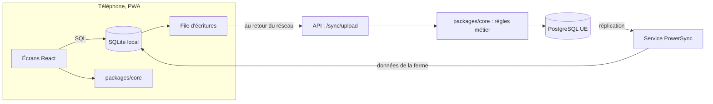

# Choix du moteur de synchro hors ligne

Recommandation du 2026-09-25, validée par Théophane le même jour. Sources ouvertes le même jour, listées en fin de page.

**Recommandation : PowerSync, auto-hébergé en UE, derrière une petite couche à nous (`packages/sync`).** C'est la seule option mûre qui réunit, dans notre stack, les cinq besoins du brief :

- un vrai SQLite sur le téléphone, qui accepte des requêtes SQL avec jointures ;
- des écritures hors ligne gardées dans une file d'attente, même plusieurs jours ;
- un serveur qui a le dernier mot, via notre propre API : c'est là que tournent les règles métier et la validation des propositions ;
- des données découpées par ferme ;
- PostgreSQL comme référence.

**Principal risque : dépendre d'un petit éditeur**, avec un service sous licence « source disponible » (FSL) qui devient libre (Apache 2.0) deux ans après chaque version. Ce risque est limité : nos données restent dans notre Postgres, et le chemin d'écriture est notre API. En sortir, c'est remplacer la partie lecture de la synchro (20 à 30 jours), pas réécrire l'application.

## Comparaison

| Critère | PowerSync | Electric | Maison |
| --- | --- | --- | --- |
| Écritures hors ligne | Oui : file d'attente persistante sur le téléphone | Non : Electric ne synchronise que la lecture ; les écritures sont à construire | Oui, tout à écrire |
| Refus d'une écriture par le serveur | Oui : notre API répond, le motif redescend par la synchro | À construire | À construire |
| Base sur le téléphone | Vrai SQLite (wa-sqlite, OPFS), SQL libre avec jointures | Pas de SQLite ; moteur en mémoire (TanStack DB), persistance en alpha | SQLite (wa-sqlite), à assembler |
| Postgres et Drizzle | Postgres stable ; pilote Drizzle en bêta | Postgres natif | Deux schémas à garder alignés |
| Découpage par ferme et droits | Sync Streams (stables), filtre SQL par `ferme_id` | Une table à la fois, droits via un proxy à nous | À écrire |
| Poids sur le téléphone | WASM d'environ 510 Kio gzip, chargé en arrière-plan | — | Même WASM |
| Licence, hébergement | Service FSL puis Apache 2.0, SDK Apache 2.0 ; auto-hébergement gratuit (Docker) | Apache 2.0 ; offre hébergée qui ferme (rachat par Databricks, août 2026) | Aucune |
| Maturité | Versions mensuelles, SDK web 2.4.1 (23/09/2026), clients en production | Équipe réorientée ; TanStack DB en 0.6 avec 13 défauts ouverts sur la persistance | Aucun utilisateur |
| Effort (1 dev + IA) | 6 à 10 jours | 25 à 40 jours | 36 à 55 jours, puis maintenance |

Écartés rapidement : Zero (pas d'écritures hors ligne), Replicache (en maintenance), Triplit (pas Postgres), cr-sqlite (peu actif, sans Postgres), RxDB (pas de SQL avec jointures, stockage SQLite payant), LiveStore (ne synchronise pas des tables Postgres), Turso (pas Postgres), Instant (arrêt annoncé), PGlite (Postgres dans le navigateur, environ 3 Mo).

## Comment PowerSync s'insère chez nous

1. **Au champ, sans réseau** : valider une proposition écrit tout de suite dans le SQLite du téléphone (l'événement, la récolte, le mouvement de stock, l'historique). L'écran change immédiatement.
2. **Au retour du réseau** : la file envoie ces écritures à notre API. L'API vérifie la ferme, rejoue les règles de `packages/core` (dose phyto, conflit d'occupation, recalcul des dates) et écrit dans Postgres en une seule transaction. Les identifiants UUID v7 rendent un double envoi sans effet.
3. **Refus métier** : l'API ne bloque pas la file. Elle enregistre le refus et son motif, qui redescendent sur le téléphone : le maraîcher voit pourquoi.
4. **Découpage** : chaque téléphone ne reçoit que les données de sa ferme, plus la bibliothèque de référence partagée.

Nos choix de modèle évitent déjà la plupart des conflits : événements en ajout seul, stock calculé comme une somme de mouvements. Pour les modifications de séries et d'occupations, la dernière écriture gagne champ par champ, avec l'historique pour revenir en arrière.

## Points de vigilance

- **Budget de 300 ms** : le SQLite (WASM) se charge en arrière-plan et ne compte pas dans le budget de poids de démarrage, mais un écran avec des données doit tenir 300 ms base comprise. Premier ticket de la phase 1 : mesurer l'ouverture de la base et une requête sur les données réelles des Jardins de Garonne, CPU ralenti ×4.
- **iPhone** : Safari efface les données d'un site au bout de 7 jours sans visite, sauf si la PWA est installée sur l'écran d'accueil. L'installation sera demandée dès la première connexion.
- **Pilote Drizzle en bêta, pas de contraintes locales** : si besoin, passage aux « raw tables » pour les tables les plus lues.
- **Exploitation** : surveiller le slot de réplication de Postgres (le journal grossit si le service PowerSync s'arrête) ; vérifier que l'hébergeur Postgres en UE autorise la réplication logique.

## Option maison, pour mémoire

Environ 36 à 55 jours : SQLite dans le navigateur, schéma local, file d'écritures, endpoint d'envoi, flux de changements fiable, réconciliation, temps réel, tests de convergence multi-appareils. Les pièges connus (lignes perdues sans bruit avec un simple `updated_at`, mutations en attente pendant un changement de schéma) en font un chantier plus long que toute la phase 0. C'est aussi notre porte de sortie si PowerSync disparaît.

## Sources

- [PowerSync : écritures côté client](https://docs.powersync.com/handling-writes/writing-client-changes.md) : file d'attente, `uploadData`, une réponse 4xx bloque la file, les 5xx sont réessayées.
- [PowerSync : conflits](https://docs.powersync.com/handling-writes/handling-update-conflicts.md) : le serveur fait foi, la dernière écriture gagne champ par champ.
- [PowerSync : SDK web](https://docs.powersync.com/client-sdks/reference/javascript-web.md) : wa-sqlite, VFS, SQL libre.
- [PowerSync : pilote Drizzle](https://docs.powersync.com/client-sdks/orms/js/drizzle.md) et [état des fonctionnalités](https://docs.powersync.com/resources/feature-status.md) : Drizzle en bêta, Sync Streams et Postgres stables.
- [PowerSync : Sync Streams](https://docs.powersync.com/sync/streams/overview.md) et [limites](https://docs.powersync.com/resources/performance-and-limits.md) : découpage par filtre, 1 000 buckets, 1 million de lignes par appareil.
- [PowerSync : auto-hébergement](https://docs.powersync.com/intro/self-hosting.md) et [maintenance Postgres](https://docs.powersync.com/configuration/source-db/postgres-maintenance.md) : image Docker, slots de réplication.
- [Licence du service PowerSync](https://github.com/powersync-ja/powersync-service/blob/main/LICENSE) : FSL-1.1-ALv2, seul l'usage concurrent est interdit, Apache 2.0 après deux ans.
- [Prix PowerSync](https://www.powersync.com/pricing) et [versions du SDK web](https://releases.powersync.com/announcements/powersync-js-web-client-sdk).
- [Electric : écritures](https://electric.ax/docs/guides/writes) : pas de synchro des écritures.
- [Electric rejoint Databricks](https://electric.ax/blog/2026/08/11/electric-joining-databricks) : fermeture d'Electric Cloud, projets libres maintenus.
- [TanStack DB 0.6](https://tanstack.com/blog/tanstack-db-0.6-app-ready-with-persistence-and-includes) et [défauts de persistance](https://github.com/TanStack/db/issues/1659).
- [Zero : hors ligne](https://zero.rocicorp.dev/docs/offline), [Replicache](https://replicache.dev/), [RxDB premium](https://rxdb.info/premium/), [Instant](https://www.instantdb.com/docs), [PGlite](https://pglite.dev/).
- [Stockage web et effacement par Safari](https://web.dev/articles/storage-for-the-web).
