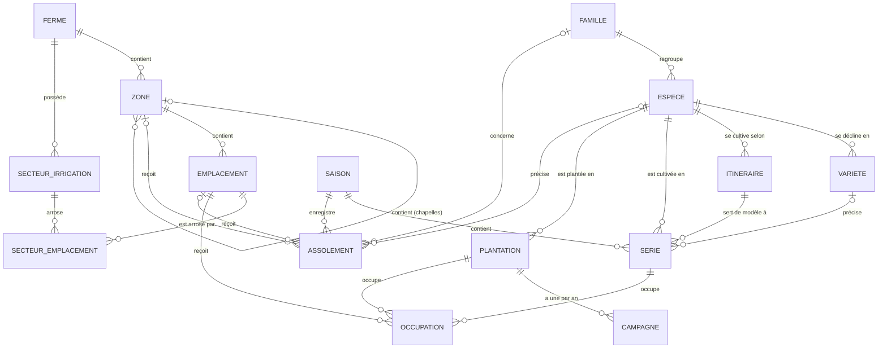
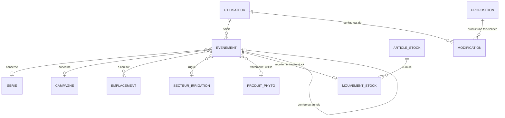

# Modèle de données — v1

Validé par Théophane le 2026-09-25 (critère de sortie de la phase 0). Elle s'appuie sur les réponses Q1 à Q4 de [`questions.md`](questions.md).

Le modèle tient en quatre blocs : **parcellaire**, **bibliothèque**, **planification**, **journal de terrain** (avec stocks et registre phyto). Une planche est une ligne de temps : ce sont les **occupations datées** qui la remplissent. Avec l'**assolement enregistré** sur plusieurs années, elles alimentent le semainier et les alertes de rotation.

## Ce qui est déjà validé

- **Découpage** : ferme → zone → emplacement (planche, rang ou gouttière). L'irrigation est une couche à part : une vanne arrose un ou plusieurs emplacements.
- **Série** : une culture, une date, un itinéraire, une longueur d'emplacement, avec du prévu et du réel. Les pérennes ont une **plantation** pluriannuelle et une **campagne** par an.
- **Saisies au champ** : réalisé, récolte, intervention, irrigation, traitement phyto, observation, plus le **travail du sol**.
- **Assolement** : il se décide selon les cas par zone, par chapelle ou par planche, et il doit être **enregistré sur plusieurs années**, parce qu'on ne remet pas des choux au même endroit avant 4, 5 ou 6 ans.

## Vue d'ensemble

Parcellaire, bibliothèque et planification :



Journal de terrain, stocks, registre phyto et validation :



## 1. Parcellaire

| Entité | Champs principaux | Remarques |
| --- | --- | --- |
| Ferme | nom, fuseau horaire, position (pour la météo), unités | Chaque ligne de chaque table porte `ferme_id` : c'est la frontière de la synchro et de l'export. |
| Zone | nom, zone parente (facultative), type d'abri (plein champ, tunnel, serre, hors-sol), surface | Un tunnel, une serre, un îlot, le verger. Une zone peut contenir des sous-zones : une serre multichapelle contient ses chapelles, un îlot ses sous-îlots. |
| Emplacement | code court, sorte (planche, rang, gouttière), longueur (m), largeur (m), nombre de places (gouttière), actif du / au, remplace (anciens emplacements) | Le code (`T2-P03`) est unique dans la ferme : c'est ce que la voix reconnaît (« planche 3 du tunnel 2 »). Le lien « remplace » garde l'historique de rotation quand on redessine des planches. |
| Secteur d'irrigation | numéro de vanne, nom, débit (facultatif), adresse Modbus (phase 3) | Les 60 vannes. |
| Secteur ↔ emplacement | secteur, emplacement, du / au | Plusieurs emplacements par vanne, éventuellement dans plusieurs zones. Datée pour garder l'historique si le réseau change. |

## 1 bis. Placement réel — v1.x (validée le 2026-10-07, Q31)

Validée par Théophane le 2026-10-07 (réponses à Q30 et Q31), posée par T28a. Elle ajoute des colonnes nulles et une table : une ferme qui ne place rien ne change pas.

**Repère local de la ferme** : mètres, x vers l'est, y vers le nord. Son origine est un champ à part, `ferme.origine_plan` (latitude, longitude), distinct de `ferme.position` (météo) : changer la position météo ne déplace pas la ferme. Elle est fixée au premier placement et ne change plus tant qu'un placement existe (règle du serveur, T28s). **Orientation** : cap en degrés, sens horaire depuis le nord, dans [0, 360[.

| Entité | Champs ajoutés | Remarques |
| --- | --- | --- |
| Ferme | origine du plan (latitude, longitude), facultative | Point (0, 0) de toutes les positions en mètres. |
| Zone | contour : liste de sommets `{x, y}` en mètres, facultatif | Polygone libre (Q31), 3 à 200 sommets, rangé en sens antihoraire. Nul : zone pas placée, ou abritée par un bâtiment. |
| Emplacement | position x, position y (m), orientation (°), facultatives | **Dans le repère de sa zone** : bouger la serre bouge ses planches. Les trois nulles ensemble : rangement automatique dans la zone. |
| Bâtiment (nouvelle) | nom, type (serre tunnel, serre chapelle, hangar, magasin, autre), longueur, largeur, hauteur (m), centre x, y (m), orientation (°), zone abritée (facultative) | Toujours un rectangle, toujours placé. Une serre abrite au plus une zone de sa ferme, et une zone au plus un bâtiment non supprimé. Suppression douce, historique, UUID v7, comme le reste du parcellaire. |

**Serre et zone** : une zone abritée par un bâtiment n'a pas de contour à elle. Sa forme est le rectangle du bâtiment, son repère celui du bâtiment (centre, orientation). Une zone sans bâtiment a son polygone ; son repère est le centroïde de surface du polygone et le cap de son plus long côté, ramené dans [0, 180[ (le premier dans l'ordre des sommets à égalité). Rattacher un bâtiment à une zone qui a un contour : l'écran efface le contour, avec confirmation (T28b) ; la base refuse les deux à la fois.

**Repère d'une zone** : l'axe y' suit la longueur (cap θ), l'axe x' est à sa droite (cap θ + 90°). Les coins d'un bâtiment sont (±largeur/2, ±longueur/2) dans ce repère.

**Exemples chiffrés** (`packages/core/src/placement`, tests à l'appui) :

- Origine à 44° N, 1,5° E : le point 44,000 898 3° N, 1,501 248 8° E est à 100 m au nord et 100 m à l'est, soit (100, 100). Projection locale : x = R·Δλ·cos φ0, y = R·Δφ, R = 6 378 137 m ; aller-retour à moins de 1 cm dans un rayon de 5 km.
- Planche à (2, 0) dans une serre centrée en (50, 30), tournée de 90° (longueur vers l'est) : (50, 28) dans la ferme. La serre déplacée en (150, 30), orientation 0 : la même planche est en (152, 30).
- Zone en L sans serre, sommets (0, 0) (20, 0) (20, 10) (10, 10) (10, 30) (0, 30) : aire 400 m², centroïde (7,5 ; 12,5) (pas la moyenne des sommets), plus long côté nord-sud, orientation 0°.

**Règles d'un placement** (`validerPlacement`, `validerContour`, rejouées par le serveur en T28s) :

- Contour : 3 à 200 sommets aux coordonnées finies, à 5 km au plus de l'origine, pas deux sommets consécutifs à moins de 1 mm (un contour fermé, premier sommet répété, est refusé), pas d'auto-intersection (deux côtés non adjacents sans point commun), aire de plus de 0,1 m². Un contour horaire est rendu antihoraire.
- Emplacement : tout ou rien des trois champs, orientation dans [0, 360[, à 5 km au plus du centre de sa zone.
- Bâtiment : tous les champs obligatoires, dimensions > 0 avec plafonds de 500 m de long, 200 m de large, 30 m de haut, orientation dans [0, 360[, centre à 5 km au plus de l'origine.
- Zone abritée : pas de contour.
- Messages de refus en français.

**Ce que la base rejoue** (migrations 0025 à 0028) : les bornes simples (tout ou rien, orientation, distance, dimensions et plafonds, type, contour : tableau de 3 à 200 objets `{x, y}` numériques à 5 km au plus, texte de 16 384 caractères au plus), la zone d'un bâtiment de la même ferme (clé étrangère composée), un bâtiment non supprimé par zone (index unique partiel), zone abritée sans contour (déclencheurs). La géométrie (auto-intersection, aire, sens) reste au serveur. `origine_plan` n'a pas de bornes en base.

**Droits** : **gérant seulement** pour tout placement (zones, planches, bâtiments, origine du plan), contrôlé par le serveur (T28s, voir « Placement réel écrit par le téléphone » plus bas).

**Synchro et export** : `batiment` descend sur les téléphones avec le même découpage par ferme que `zone` ; l'export ajoute `batiment.csv` et les nouvelles colonnes, décrites dans LISEZMOI.txt.

## 2. Bibliothèque de cultures

| Entité | Champs principaux | Remarques |
| --- | --- | --- |
| Famille botanique | nom, délai de retour minimal (années), délai de retour conseillé (années) | Sert aux alertes de rotation. Réglable par ferme. |
| Espèce | nom, famille, catégorie (légume, petit fruit, fruit, fleur, aromatique, engrais vert), pérenne oui/non, unité de récolte par défaut (kg, botte, pièce, barquette), délais de retour propres (facultatifs) | Les engrais verts sont des espèces comme les autres : ils comptent dans la rotation. Les délais de l'espèce remplacent ceux de la famille quand ils sont remplis (choux : 4 ans minimum, 6 conseillés). |
| Variété | espèce, nom, fournisseur, poids de mille graines, taux de germination | |
| Itinéraire technique | espèce, variété (facultative), nom, mode (semis direct, plant maison, plant acheté), période d'usage (semaines), type d'abri, durée en pépinière (jours), durée avant récolte (jours), fenêtre de récolte (jours), façon de compter la densité (écartement, au mètre linéaire, à la volée) et ses paramètres (rangs par planche, écartement sur le rang en cm, graines par mètre, largeur semée, dose en g/m²), graines par poquet ou par motte, plants par motte, perte en pépinière (%), alvéoles par plaque, marge de sécurité (%), rendement attendu (par m ou par plant) | Pour les pérennes : années avant la première récolte (asperges), période de récolte annuelle, rendement par plant et par an. Le détail des calculs de besoins est dans le ticket T05. Travaux prévus (T22) : liste `travauxPrevus` rangée dans le jsonb `parametres` (catégorie et type d'intervention, repère et décalage en jours, répétition tous les N jours jusqu'à un repère de fin compris, outil, produit et quantité obligatoires en fertilisation et amendement, temps estimé en minutes par 100 m ou par planche), copiée dans l'instantané de la série ; une contrainte CHECK exige un tableau jsonb. |

La bibliothèque de référence (base INRAE Pépinière-Mesclun) est en lecture seule. Une ferme copie ce qu'elle utilise et l'ajuste chez elle.

## 3. Planification

| Entité | Champs principaux | Remarques |
| --- | --- | --- |
| Saison | nom (« 2027 »), début, fin | Une série appartient à la saison de sa mise en place. |
| Travail prévu d'itinéraire | type d'intervention, repère (semis en pépinière, mise en place, début ou fin de récolte), décalage en jours, répétition facultative (tous les N jours jusqu'à un repère), outil, produit et quantité facultatifs, temps estimé facultatif (min par 100 m ou par planche) | Rangé dans l'itinéraire (Q22, T22) et copié dans l'instantané de la série. Le semainier en tire les tâches ; un événement « intervention » du même type les solde. |
| Série | espèce, variété, itinéraire, **instantané des paramètres**, ancre (semis, plantation ou début de récolte) + date d'ancre, dates prévues calculées (semis pépinière, mise en place, début et fin de récolte), longueur totale (m) ou nombre de plants, statut | L'instantané fige les paramètres de l'itinéraire à la création : modifier un itinéraire ne réécrit jamais une série passée. |
| Plantation | espèce, variété, date de plantation, nombre de plants, date d'arrachage (vide tant qu'elle est en place) | Kiwis, asperges, pivoines, fraisiers conservés plusieurs années. |
| Campagne | plantation, année, dates de récolte prévues, rendement prévu | Porte la taille, les récoltes et le rendement de l'année. |
| Occupation | emplacement, série **ou** plantation, longueur (m) ou nombre de places, position sur la planche (facultative), du / au prévus, du / au réels | Le cœur de la dimension temporelle, voir ci-dessous. |
| Assolement | saison, cible (zone, chapelle ou emplacement), famille ou espèce, nature (prévu, passé saisi, passé importé) | Enregistré, jamais effacé. Il sert à planifier la rotation avant de détailler les séries, et à garder l'historique des années où aucune série n'existe dans l'appli. |

L'ancre permet de planifier à rebours : « je veux des batavias à partir de la semaine 22 » donne la date de plantation et la date de semis en pépinière.

L'assolement enregistré est indispensable dès le premier jour. Quand une ferme arrive, l'appli ne connaît aucune de ses séries passées. Pour savoir que des choux étaient dans la chapelle 3 en 2023, il faut pouvoir le saisir ou l'importer en une ligne, sans recréer la série.

## 4. La dimension temporelle des planches

Trois choses changent avec le temps, et chacune est datée :

1. **Ce qui occupe l'emplacement** : une occupation par série ou plantation, sur un intervalle de dates. La pépinière n'occupe pas la planche ; l'occupation commence à la mise en place et finit à l'arrachage.
2. **L'emplacement lui-même** : actif du / au. Redessiner des planches crée de nouveaux emplacements sans effacer l'historique des anciens.
3. **Le lien avec l'irrigation** : secteur ↔ emplacement, daté aussi.

Exemple d'une planche de 30 m sous tunnel :

```text
T2-P03 (30 m)            S10   S14   S18   S22   S26   S30   S34
 0–30 m  Radis   s.12    ████
 0–15 m  Batavia s.18          ██████████
15–30 m  Batavia s.19             ██████████
 0–30 m  Tomate  s.25                          ████████████████
```

Ce que le moteur en tire :

- **Conflit d'occupation** : deux occupations qui se chevauchent dans le temps et dont les longueurs dépassent celle de la planche (ou dont les positions se recouvrent).
- **Alerte de rotation** : même famille (ou même espèce si elle a ses propres délais) sur le même endroit avant la fin du délai de retour. Le moteur lit, sur plusieurs années, les occupations réelles et l'assolement enregistré, pour la planche elle-même et pour sa chapelle et sa zone. Des choux notés sur toute la chapelle 3 en 2023 concernent donc chacune de ses planches. En dessous du délai minimal, l'alerte est rouge ; entre le minimal et le conseillé, elle est orange.
- **Décalage** : quand un réalisé arrive en retard, les dates prévues restantes de la série et de son occupation glissent d'autant.

Les dates prévues d'une occupation sont recalculées par le moteur à chaque changement de la série, jamais saisies à la main. Elles sont stockées pour que la vue 2D planches × semaines s'affiche vite.

## 5. Journal de terrain

Toute saisie au champ est un **événement** : quoi, où, combien, quand, par qui, et d'où ça vient.

| Champ commun | Remarques |
| --- | --- |
| type | réalisé, récolte, intervention, irrigation, traitement, observation |
| date et heure, auteur | remplis automatiquement |
| source | tap, voix, agent, photo, import |
| cible | série ou campagne, et/ou un ou plusieurs emplacements, et/ou un secteur d'irrigation |
| note, photos | facultatives ; les photos restent sur le téléphone jusqu'au retour du réseau |

| Type | Où vont les détails | Champs propres |
| --- | --- | --- |
| Réalisé | événement | étape (semis pépinière, semis direct, plantation, arrachage), quantité réelle si différente du prévu |
| Récolte | détail de l'événement (vue `recoltes`) | quantité, unité, catégorie (facultative) |
| Intervention | détail de l'événement (vue `interventions`) | type, outil, produit et quantité pour un amendement ou un engrais, durée d'occupation pour une bâche |
| Irrigation | événement | secteur, durée (min) |
| Traitement phyto | détail de l'événement (vue `traitements`, registre phyto) | produit, dose, surface traitée (m²), cible, opérateur ; date de récolte autorisée calculée avec le délai avant récolte |
| Observation | événement | nature (ravageur, maladie, stade, autre), gravité (facultative) |

Réponse à Q10 (2026-09-29) : tous les types sont un seul **événement** du journal, en ajout seul, avec un détail propre au type. Il n'y a pas de tables Récolte, Intervention ni Traitement : les vues SQL `recoltes`, `interventions` et `traitements` les présentent pour les exports et le registre phyto, en ne montrant que la version en vigueur (sans les événements annulés ni ceux remplacés par une correction). Une correction ou une annulation est un nouvel événement de la même ferme et du même type. Détails dans `packages/db/README.md` (T08).

Types d'intervention proposés au départ, modifiables par chaque ferme :

- **Travail du sol** : labour, décompactage, grelinette, rotobêche, herse, buttage, préparation de planche, faux semis.
- **Couverture** : paillage, bâchage ou occultation, solarisation. Une couverture longue réserve l'emplacement : elle crée une occupation.
- **Fertilisation et amendement** : compost, fumier, engrais (produit et quantité, pour le cahier de fertilisation).
- **Entretien** : désherbage, taille, palissage, effeuillage, éclaircissage, autre.

## 6. Stocks et registre phyto

| Entité | Champs principaux | Remarques |
| --- | --- | --- |
| Article de stock | espèce, variété (facultative), unité, catégorie | Ce qui se compte en chambre froide ou au magasin. |
| Mouvement de stock | article, quantité (+ ou −), motif (récolte, vente, perte, ajustement), récolte liée | Une récolte validée crée automatiquement son entrée en stock. |
| Produit phyto | nom commercial, n° AMM, substance active, délai avant récolte (jours), utilisable en bio oui/non, dose maximale | Le registre et l'export pour le contrôle bio se lisent dans les traitements. |

Le stock n'est jamais un compteur stocké : c'est la somme des mouvements. Deux téléphones hors ligne ne peuvent donc pas se contredire.

## 7. Validation, historique et règles transversales

- **Propositions** : tout ce qui vient de la voix, de l'agent ou d'une photo est d'abord une *proposition* (liste de changements, statut en attente, validée ou rejetée). Rien n'entre dans les tables réelles avant le tap de validation.
- **Journal des modifications** : chaque création, modification ou suppression garde qui, quand, avant, après, et la proposition d'origine. C'est l'historique consultable par l'utilisateur, et ce qui rend chaque action annulable.
- **Identifiants** : UUID v7 générés sur le téléphone, pour créer des lignes hors ligne sans collision.
- **Suppression douce** : une ligne supprimée est marquée, pas effacée. La synchro et l'annulation en ont besoin.
- **Événements en ajout seul** : un événement ne se modifie pas, il se corrige par un nouvel événement ou s'annule. C'est ce qui rend la synchro hors ligne sans conflit sur le journal.
- **Unités** : mètres, jours, kilos. L'interface parle en semaines ; le stockage reste en dates.
- **Export** : chaque table en JSON et en CSV, sans condition.

### Parcellaire et catalogue écrits par le téléphone (T10s)

Le serveur (`apps/api/src/sync/structure.ts`, règles de ligne dans `structure-lignes.ts`) accepte ce qu'un téléphone crée ou modifie, hors ligne compris (import de T14b, écrans de structure) :

- **Tables** : zone, emplacement, saison, assolement (toujours d'une ferme) ; famille, espèce, variété seulement pour les lignes **de la ferme**. Une ligne de la bibliothèque commune (`ferme_id` nul) n'est jamais créée, modifiée ni supprimée par un téléphone : elle se comporte comme une ligne inexistante.
- **Droits** : les mêmes que pour les séries, tout membre actif de la ferme (gérant ou équipier). Un membre retiré ou un invité qui n'a pas encore accepté n'écrit rien.
- **Isolement** : `ferme_id` ne change jamais. Zone parente, zone d'un emplacement, emplacements remplacés, saison, zone et emplacement d'un assolement : de la même ferme. Famille d'une espèce, espèce d'une variété, famille et espèce d'un assolement : de la ferme ou de la bibliothèque. Une ligne d'une autre ferme, même une autre ferme du même utilisateur, compte comme introuvable. Une ligne écrite plus haut dans le même envoi se désigne (import).
- **Validation** : contraintes du schéma rejouées avant l'écriture (noms non vides de 200 caractères au plus comme une cellule d'import, listes fermées, longueurs et surfaces > 0, gouttière ⇔ nombre de places, périodes dans l'ordre, délai de retour minimal ≤ conseillé, germination 0–100 %, assolement à une seule cible, origine d'import réservée au passé importé, dates réelles de 1900 à 2100), plafonds contre les fautes de frappe (10 km de long, 1 000 m de large, 1 000 ha, 1 000 000 de places, 100 ans de délai, 100 kg pour mille graines, 200 emplacements remplacés), pas de boucle dans l'arbre des zones, espèce d'un assolement de la famille de l'assolement.
- **Tout ou rien** : un envoi qui touche ces tables est accepté ou refusé en entier, avec les séries, itinéraires, événements et le stock qu'il contient.
- **Suppression** : douce seulement (`supprime_le`), refusée tant que la ligne sert encore. Emplacement : occupation non supprimée d'une série prévue ou en cours non supprimée, ou d'une plantation en place (sans date d'arrachage, ou arrachage prévu après la date du jour). Espèce, variété : série prévue ou en cours, ou plantation en place. Zone : emplacement ou sous-zone non supprimés. Famille : espèce de la ferme non supprimée. Saison : série prévue ou en cours. Une série terminée, abandonnée ou supprimée ne retient rien.
- **Historique** : une ligne `modification` par ligne touchée (création, modification, suppression), écrite par le serveur.
- **Série réactivée** : une série terminée ou abandonnée qui redevient prévue ou en cours est revérifiée comme un rétablissement (saison, espèce, variété actives, emplacements de ses occupations non supprimés).
- **Pas encore contrôlé** : l'unicité du code d'emplacement dans la ferme (question posée à Théophane).

### Placement réel écrit par le téléphone (T28s)

Le serveur (`structure.ts`, `structure-lignes.ts`, `structure-origine.ts`) accepte le placement fait sur un appareil, hors ligne compris ; la porte (`porte.placer`, `packages/sync/src/placement.ts`) rejoue les mêmes règles avant d'écrire et rend de quoi annuler.

- **Ce qui s'écrit** : `batiment` (création, modification, suppression douce et rétablissement ; pas de DELETE) ; `zone.contour` ; `placement_x_m`, `placement_y_m`, `orientation_deg` d'un emplacement ; de `ferme`, **seulement** `origine_plan` (toute autre colonne refusée ; une ferme ne se crée ni ne s'efface par la synchro).
- **Droits (Q31)** : gérant actif de la ferme de la ligne, rôle relu à chaque envoi. Un équipier qui crée, modifie ou supprime un bâtiment, pose, redessine ou efface un contour, place, déplace ou range une planche, ou pose l'origine : refusé (« seul le gérant peut placer les éléments de la ferme »). Reste ouvert à tout membre : créer une zone ou une planche sans placement, les modifier sans toucher au placement, les supprimer (règles de T10s), et renvoyer à l'identique une ligne placée (rien n'est écrit).
- **Isolement** : comme T10s ; la zone d'un bâtiment est de sa ferme (une zone d'une autre ferme, même du même utilisateur, est introuvable). Une ferme dont on n'est pas membre actif est introuvable.
- **Validation** : `validerPlacement` et `validerContour` du cœur, sur la ligne complète. Contour reçu en texte JSON de 16 384 caractères au plus, mesuré avant de le lire (sinon refusé sans être parcouru), rangé en sens antihoraire, x et y seulement. Bâtiment : nom, type, dimensions, centre et orientation ; sa zone est non supprimée, sans contour, et sans autre bâtiment non supprimé. Contour refusé sur une zone abritée.
- **Origine du plan** : s'écrit si elle est nulle, ou tant que la ferme n'a aucun placement (bâtiment non supprimé, zone non supprimée avec contour, emplacement non supprimé placé), ceux écrits plus haut dans le même envoi compris ; sinon figée (l'effacer aussi est refusé). Pas d'origine exigée avant le premier bâtiment.
- **Suppression** : supprimer le bâtiment d'une zone la laisse telle quelle (elle redevient « pas placée ») ; supprimer une zone abritée par un bâtiment non supprimé est refusé (supprimer ou détacher le bâtiment d'abord, éventuellement plus haut dans le même envoi).
- **Tout ou rien et concurrence** : `batiment` et `ferme` rejoignent les envois tout ou rien, écrits sous le verrou de chaque ferme touchée ; interblocage ou échec de sérialisation : erreur à réessayer (5xx), jamais un refus définitif.
- **Historique** : une ligne `modification` par ligne touchée (`Batiment`, `Zone`, `Emplacement`, `Ferme`).

## 8. Ce qui est calculé, pas stocké

| Vue | Calculée à partir de |
| --- | --- |
| Semainier (semis, plantations, récoltes de la semaine) | dates prévues des séries et campagnes, moins les réalisés déjà saisis |
| Assolement réel (vue par année) | occupations par emplacement et par saison, complétées par l'assolement passé enregistré |
| Besoins en semences et en plants | longueurs des séries + densité, graines par motte, germination et marge de l'itinéraire |
| Stock | somme des mouvements |
| Alertes (rotation, conflit, délai avant récolte) | occupations, familles, traitements |

## Choix par défaut, modifiables

- Catégorie de récolte (calibre, catégorie I ou II) : champ facultatif dès la phase 1, sans liste imposée.
- Profondeur des sous-zones : libre dans le modèle ; l'interface propose deux niveaux (zone puis chapelle ou sous-îlot).
