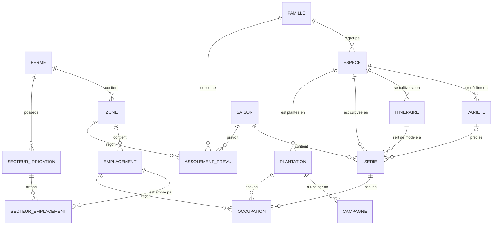
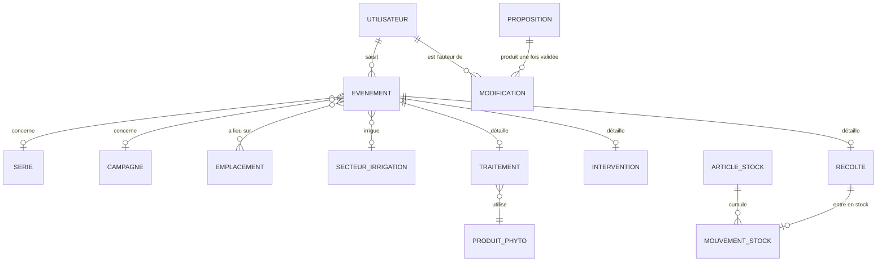

# Modèle de données — proposition v1

Proposition du 2026-09-25, à valider par Théophane (critère de sortie de la phase 0). Elle s'appuie sur les réponses Q1 à Q3 de [`questions.md`](questions.md).

Le modèle tient en quatre blocs : **parcellaire**, **bibliothèque**, **planification**, **journal de terrain** (avec stocks et registre phyto). Une planche est une ligne de temps : ce sont les **occupations datées** qui la remplissent, et l'assolement, le semainier et les alertes se calculent à partir d'elles.

## Ce qui est déjà validé

- **Découpage** : ferme → zone → emplacement (planche, rang ou gouttière). L'irrigation est une couche à part : une vanne arrose un ou plusieurs emplacements.
- **Série** : une culture, une date, un itinéraire, une longueur d'emplacement, avec du prévu et du réel. Les pérennes ont une **plantation** pluriannuelle et une **campagne** par an.
- **Saisies au champ** : réalisé, récolte, intervention, irrigation, traitement phyto, observation, plus le **travail du sol**. L'**assolement** doit apparaître dans le modèle.

## Vue d'ensemble

Parcellaire, bibliothèque et planification :



Journal de terrain, stocks, registre phyto et validation :



## 1. Parcellaire

| Entité | Champs principaux | Remarques |
| --- | --- | --- |
| Ferme | nom, fuseau horaire, position (pour la météo), unités | Chaque ligne de chaque table porte `ferme_id` : c'est la frontière de la synchro et de l'export. |
| Zone | nom, type d'abri (plein champ, tunnel, serre, hors-sol), surface | Un tunnel, une serre, un îlot, le verger. |
| Emplacement | code court, sorte (planche, rang, gouttière), longueur (m), largeur (m), nombre de places (gouttière), actif du / au | Le code (`T2-P03`) est unique dans la ferme : c'est ce que la voix reconnaît (« planche 3 du tunnel 2 »). |
| Secteur d'irrigation | numéro de vanne, nom, débit (facultatif), adresse Modbus (phase 3) | Les 60 vannes. |
| Secteur ↔ emplacement | secteur, emplacement, du / au | Plusieurs emplacements par vanne, éventuellement dans plusieurs zones. Datée pour garder l'historique si le réseau change. |

## 2. Bibliothèque de cultures

| Entité | Champs principaux | Remarques |
| --- | --- | --- |
| Famille botanique | nom, délai de retour (années) | Sert aux alertes de rotation. |
| Espèce | nom, famille, catégorie (légume, petit fruit, fruit, fleur, aromatique, engrais vert), pérenne oui/non, unité de récolte par défaut (kg, botte, pièce, barquette) | Les engrais verts sont des espèces comme les autres : ils comptent dans la rotation. |
| Variété | espèce, nom, fournisseur, poids de mille graines, taux de germination | |
| Itinéraire technique | espèce, variété (facultative), nom, mode (semis direct, plant maison, plant acheté), période d'usage (semaines), type d'abri, durée en pépinière (jours), durée avant récolte (jours), fenêtre de récolte (jours), écartement rangs et plants (cm), rangs par planche, graines par motte, marge de sécurité (%), rendement attendu (par m ou par plant) | Pour les pérennes : années avant la première récolte (asperges), période de récolte annuelle, rendement par plant et par an. |

La bibliothèque de référence (base INRAE Pépinière-Mesclun) est en lecture seule. Une ferme copie ce qu'elle utilise et l'ajuste chez elle.

## 3. Planification

| Entité | Champs principaux | Remarques |
| --- | --- | --- |
| Saison | nom (« 2027 »), début, fin | Une série appartient à la saison de sa mise en place. |
| Série | espèce, variété, itinéraire, **instantané des paramètres**, ancre (semis, plantation ou début de récolte) + date d'ancre, dates prévues calculées (semis pépinière, mise en place, début et fin de récolte), longueur totale (m) ou nombre de plants, statut | L'instantané fige les paramètres de l'itinéraire à la création : modifier un itinéraire ne réécrit jamais une série passée. |
| Plantation | espèce, variété, date de plantation, nombre de plants, date d'arrachage (vide tant qu'elle est en place) | Kiwis, asperges, pivoines, fraisiers conservés plusieurs années. |
| Campagne | plantation, année, dates de récolte prévues, rendement prévu | Porte la taille, les récoltes et le rendement de l'année. |
| Occupation | emplacement, série **ou** plantation, longueur (m) ou nombre de places, position sur la planche (facultative), du / au prévus, du / au réels | Le cœur de la dimension temporelle, voir ci-dessous. |
| Assolement prévu | saison, zone (ou emplacement), famille ou groupe de cultures | Facultatif : le plan de rotation sur plusieurs années, décidé avant de détailler les séries. |

L'ancre permet de planifier à rebours : « je veux des batavias à partir de la semaine 22 » donne la date de plantation et la date de semis en pépinière.

## 4. La dimension temporelle des planches

Trois choses changent avec le temps, et chacune est datée :

1. **Ce qui occupe l'emplacement** : une occupation par série ou plantation, sur un intervalle de dates. La pépinière n'occupe pas la planche ; l'occupation commence à la mise en place et finit à l'arrachage.
2. **L'emplacement lui-même** : actif du / au. Redessiner des planches crée de nouveaux emplacements sans effacer l'historique des anciens.
3. **Le lien avec l'irrigation** : secteur ↔ emplacement, daté aussi.

Exemple d'une planche de 30 m sous tunnel :

```text
T2-P03 (30 m)            S10   S14   S18   S22   S26   S30   S34
 0–30 m  Radis   s.12    ████
 0–15 m  Batavia s.18          ██████████
15–30 m  Batavia s.19             ██████████
 0–30 m  Tomate  s.25                          ████████████████
```

Ce que le moteur en tire :

- **Conflit d'occupation** : deux occupations qui se chevauchent dans le temps et dont les longueurs dépassent celle de la planche (ou dont les positions se recouvrent).
- **Alerte de rotation** : même famille botanique sur le même emplacement avant la fin du délai de retour.
- **Décalage** : quand un réalisé arrive en retard, les dates prévues restantes de la série et de son occupation glissent d'autant.

Les dates prévues d'une occupation sont recalculées par le moteur à chaque changement de la série, jamais saisies à la main. Elles sont stockées pour que la vue 2D planches × semaines s'affiche vite.

## 5. Journal de terrain

Toute saisie au champ est un **événement** : quoi, où, combien, quand, par qui, et d'où ça vient.

| Champ commun | Remarques |
| --- | --- |
| type | réalisé, récolte, intervention, irrigation, traitement, observation |
| date et heure, auteur | remplis automatiquement |
| source | tap, voix, agent, photo, import |
| cible | série ou campagne, et/ou un ou plusieurs emplacements, et/ou un secteur d'irrigation |
| note, photos | facultatives ; les photos restent sur le téléphone jusqu'au retour du réseau |

| Type | Où vont les détails | Champs propres |
| --- | --- | --- |
| Réalisé | événement | étape (semis pépinière, semis direct, plantation, arrachage), quantité réelle si différente du prévu |
| Récolte | table Récolte | quantité, unité, catégorie (facultative) |
| Intervention | table Intervention | type, outil, produit et quantité pour un amendement ou un engrais, durée d'occupation pour une bâche |
| Irrigation | événement | secteur, durée (min) |
| Traitement phyto | table Traitement | produit, dose, surface traitée (m²), cible, opérateur ; date de récolte autorisée calculée avec le délai avant récolte |
| Observation | événement | nature (ravageur, maladie, stade, autre), gravité (facultative) |

Types d'intervention proposés au départ, modifiables par chaque ferme :

- **Travail du sol** : labour, décompactage, grelinette, rotobêche, herse, buttage, préparation de planche, faux semis.
- **Couverture** : paillage, bâchage ou occultation, solarisation. Une couverture longue réserve l'emplacement : elle crée une occupation.
- **Fertilisation et amendement** : compost, fumier, engrais (produit et quantité, pour le cahier de fertilisation).
- **Entretien** : désherbage, taille, palissage, effeuillage, éclaircissage, autre.

## 6. Stocks et registre phyto

| Entité | Champs principaux | Remarques |
| --- | --- | --- |
| Article de stock | espèce, variété (facultative), unité, catégorie | Ce qui se compte en chambre froide ou au magasin. |
| Mouvement de stock | article, quantité (+ ou −), motif (récolte, vente, perte, ajustement), récolte liée | Une récolte validée crée automatiquement son entrée en stock. |
| Produit phyto | nom commercial, n° AMM, substance active, délai avant récolte (jours), utilisable en bio oui/non, dose maximale | Le registre et l'export pour le contrôle bio se lisent dans les traitements. |

Le stock n'est jamais un compteur stocké : c'est la somme des mouvements. Deux téléphones hors ligne ne peuvent donc pas se contredire.

## 7. Validation, historique et règles transversales

- **Propositions** : tout ce qui vient de la voix, de l'agent ou d'une photo est d'abord une *proposition* (liste de changements, statut en attente, validée ou rejetée). Rien n'entre dans les tables réelles avant le tap de validation.
- **Journal des modifications** : chaque création, modification ou suppression garde qui, quand, avant, après, et la proposition d'origine. C'est l'historique consultable par l'utilisateur, et ce qui rend chaque action annulable.
- **Identifiants** : UUID v7 générés sur le téléphone, pour créer des lignes hors ligne sans collision.
- **Suppression douce** : une ligne supprimée est marquée, pas effacée. La synchro et l'annulation en ont besoin.
- **Événements en ajout seul** : un événement ne se modifie pas, il se corrige par un nouvel événement ou s'annule. C'est ce qui rend la synchro hors ligne sans conflit sur le journal.
- **Unités** : mètres, jours, kilos. L'interface parle en semaines ; le stockage reste en dates.
- **Export** : chaque table en JSON et en CSV, sans condition.

## 8. Ce qui est calculé, pas stocké

| Vue | Calculée à partir de |
| --- | --- |
| Semainier (semis, plantations, récoltes de la semaine) | dates prévues des séries et campagnes, moins les réalisés déjà saisis |
| Assolement réel | occupations par emplacement et par saison, avec la famille de chaque culture |
| Besoins en semences et en plants | longueurs des séries + densité, graines par motte, germination et marge de l'itinéraire |
| Stock | somme des mouvements |
| Alertes (rotation, conflit, délai avant récolte) | occupations, familles, traitements |

## Questions ouvertes

- L'assolement prévu se décide-t-il par zone, par emplacement, ou pas du tout (l'assolement réel suffit) ?
- Faut-il des catégories de récolte (calibre, catégorie I ou II) dès la phase 1, ou l'unité suffit-elle ?
